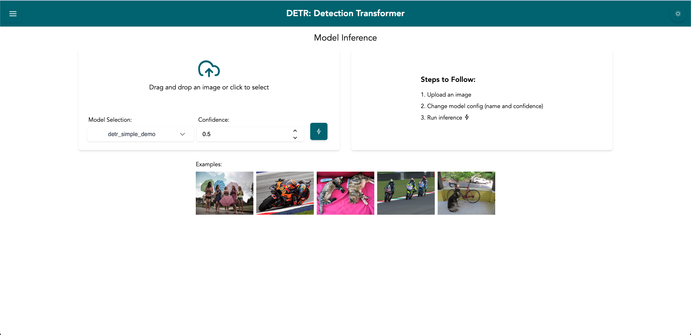
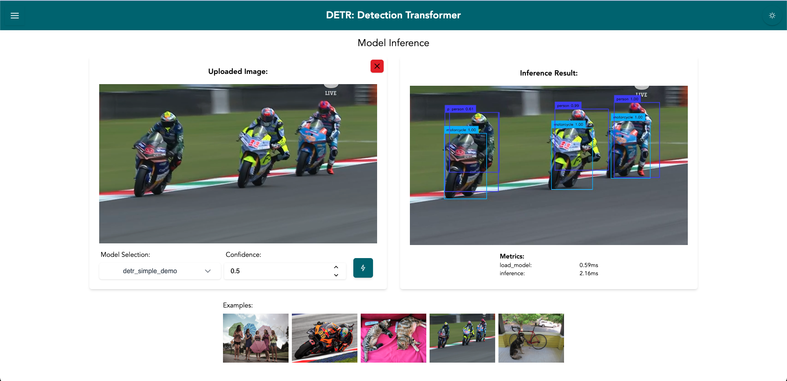
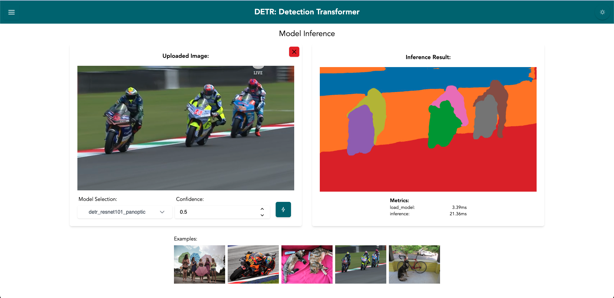
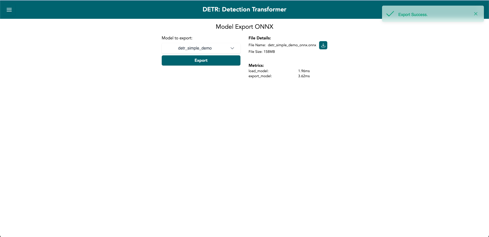

# DETR FULL STACK

Simple DETR full stacl implementation (object detection & panoptic segmentation)

## Features

- **Object Detection**
- **Panoptic Segmentation**
- **ONNX Model Export**

### Model Inference Page



### Object Detection



### Panoptic Segmentation



### ONNX Model Export



##  Tech Stack

- FE: React (UI component library Prime React)
- BE: FastAPI

## Repo structure

```text
├── README.md
├── assets
├── infra
│   └── docker-compose.yml
└── src
    ├── backend
    ├── frontend
    └── gradio
```

### Setup local environment

For configuring the local environment, please refer to the README files located in the respective frontend and backend directories:

- [src/frontend/README.md](src/frontend/README.md)
- [src/backend/README.md](src/backend/README.md)

### Setup with docker

```bash
cd infra
docker-compose up -d
```
